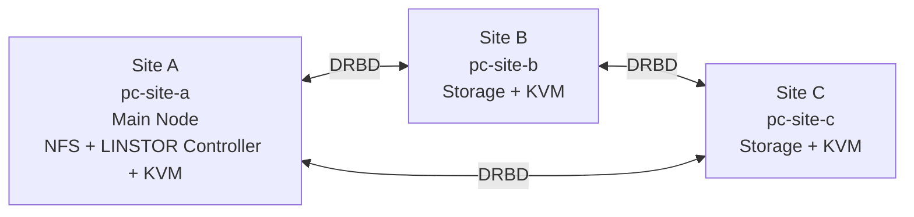

# Private Cloud Simple 3-Site

- SLES 12 SP5
- KVM / libvirt
- NFS
- LINSTOR / DRBD
- LVM Thin
- 3 server đặt ở 3 site trong cùng thành phố

---

## Mô hình



---

## Vai trò từng server

| Server | Vai trò |
|---|---|
| `pc-site-a` | Node chính, NFS, LINSTOR Controller, chạy VM |
| `pc-site-b` | Node phụ, LINSTOR Satellite, có thể chạy VM khi failover |
| `pc-site-c` | Node phụ, LINSTOR Satellite, giữ bản sao dữ liệu |

---

## Cấu trúc repo

```text
private-cloud-simple-3site/
├── README.md
├── 01-overview.md
├── 02-ip-plan.md
├── 03-install-base.md
├── 04-nfs.md
├── 05-linstor-drbd.md
├── 06-create-vm.md
├── 07-manual-failover.md
├── 08-backup.md
├── 09-daily-check.md
├── 10-upgrade-to-ha-later.md
├── scripts/
│   ├── check-system.sh
│   ├── backup-config.sh
│   └── create-vm.sh
└── .gitignore
```

---

## Thứ tự làm

Làm theo đúng thứ tự:

1. [Overview](./01-overview.md)
2. [IP Plan](./02-ip-plan.md)
3. [Install Base](./03-install-base.md)
4. [NFS](./04-nfs.md)
5. [LINSTOR / DRBD](./05-linstor-drbd.md)
6. [Create VM](./06-create-vm.md)
7. [Manual Failover](./07-manual-failover.md)
8. [Backup](./08-backup.md)
9. [Daily Check](./09-daily-check.md)
10. [Upgrade to HA Later](./10-upgrade-to-ha-later.md)

---

## Lệnh kiểm tra nhanh

```bash
./scripts/check-system.sh
```

Hoặc chạy thủ công:

```bash
linstor node list
linstor storage-pool list
linstor resource list
cat /proc/drbd
virsh list --all
df -h
```

---

## Ghi nhớ

```text
NFS      = lưu ISO/template/backup
LINSTOR  = quản lý replicated block storage
DRBD     = replicate disk giữa các node
KVM      = chạy VM
libvirt  = quản lý VM
```

Không dùng disk OS làm storage LINSTOR.

Không mount cùng một DRBD disk trên nhiều node cùng lúc nếu dùng EXT4/XFS.

Manual failover trước, HA tự động để giai đoạn sau.
